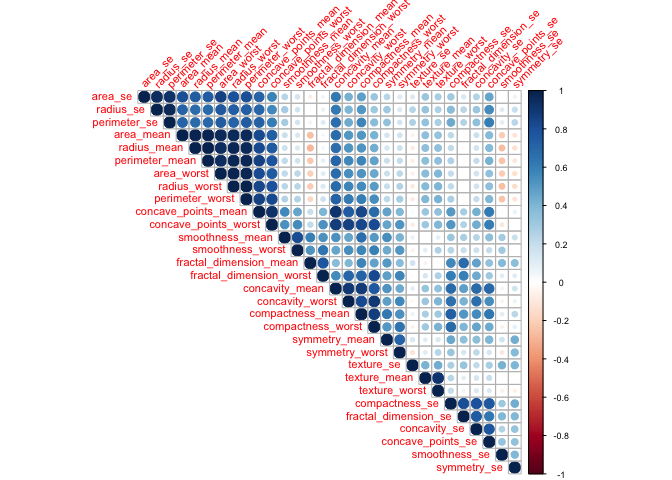
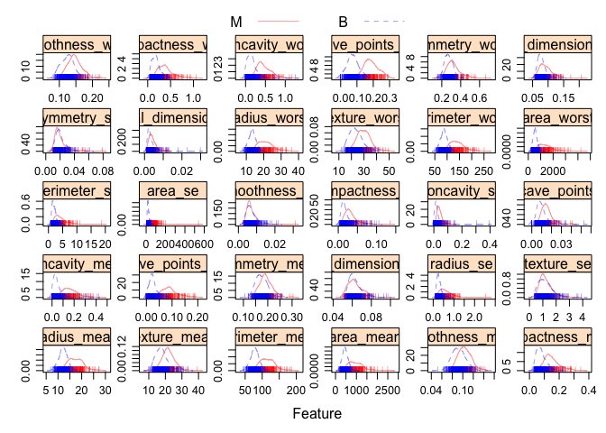
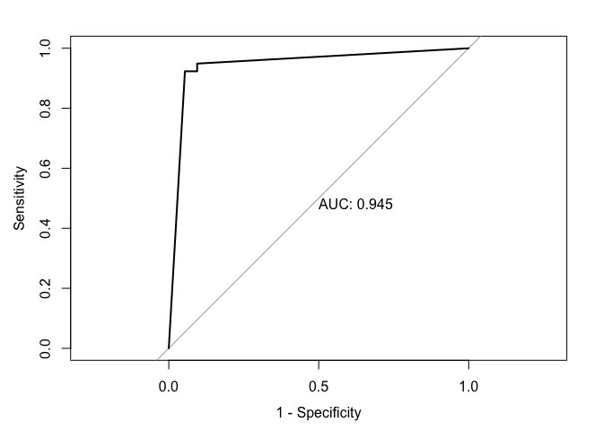
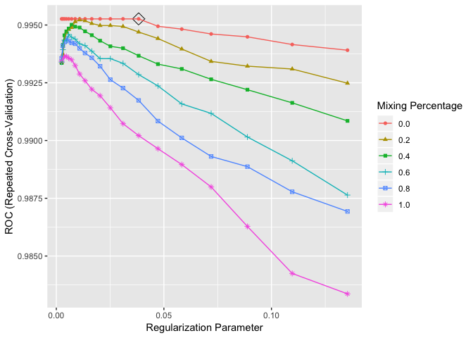
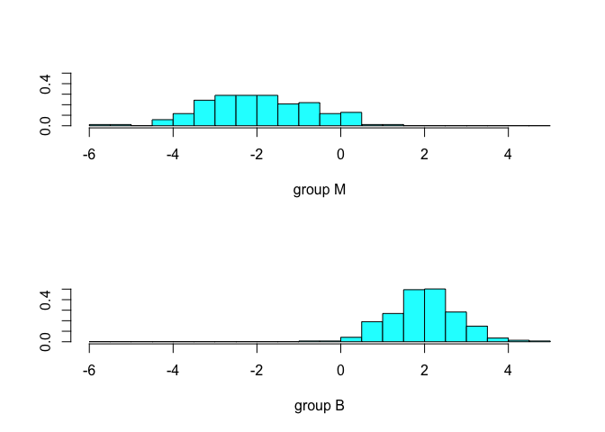
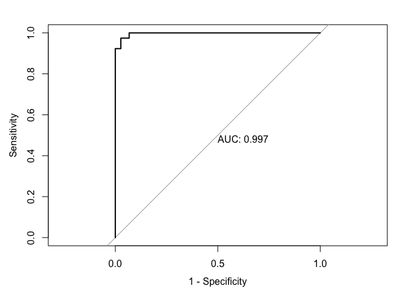
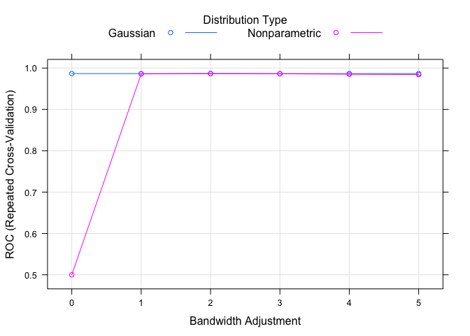
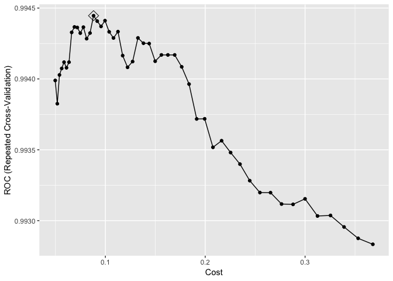
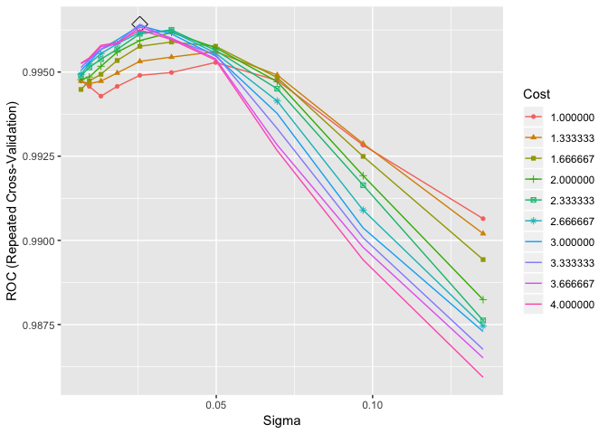
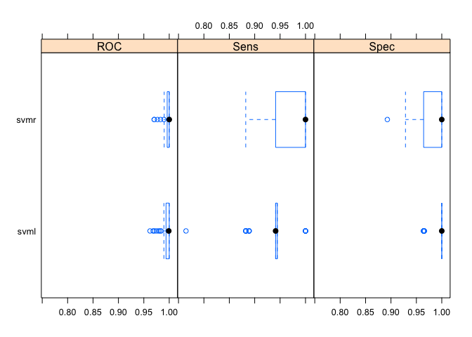

Analysis
================
Jack Yan
5/17/2019

Create a test dataset
=====================

``` r
set.seed(123123)
dat = 
  read_csv("./data.csv") %>% 
  select(-id, -X33) 
  dim(dat)
test_dat = sample_n(dat, 569/5)
train_dat = anti_join(dat, test_dat)
write_csv(train_dat, "train.csv")
write_csv(test_dat, "test.csv")
```

Load train and test data
========================

``` r
train_df = 
  read_csv("./train.csv") %>% janitor::clean_names() %>% 
  mutate(diagnosis = as_factor(diagnosis))
```

    ## Parsed with column specification:
    ## cols(
    ##   .default = col_double(),
    ##   diagnosis = col_character()
    ## )

    ## See spec(...) for full column specifications.

``` r
test_df = 
  read_csv("./test.csv")  %>% janitor::clean_names() %>% 
  mutate(diagnosis = as_factor(diagnosis))
```

    ## Parsed with column specification:
    ## cols(
    ##   .default = col_double(),
    ##   diagnosis = col_character()
    ## )
    ## See spec(...) for full column specifications.

Exploratory data analysis
=========================

### Clustering (Unsupervised learning)

### Correlation plots

``` r
x <- model.matrix(diagnosis~., train_df)[,-1]
y <- train_df$diagnosis
theme1 <- trellis.par.get()
theme1$plot.symbol$col <- rgb(.2, .4, .2, .5) 
theme1$plot.symbol$pch <- 16
theme1$plot.line$col <- rgb(.8, .1, .1, 1) 
theme1$plot.line$lwd <- 2
theme1$strip.background$col <- rgb(.0, .2, .6, .2) 
trellis.par.set(theme1)

par(cex = 0.7)
corrplot(cor(x), tl.srt = 45, order = 'hclust', type = 'upper')
```



### One-to-one relation between classes and covariates

``` r
# Distribution of response classes with regard to each variable
transparentTheme(trans = .4)
featurePlot(x = train_df[,2:31], 
            y = train_df$diagnosis,
            scales = list(x = list(relation="free"), 
                          y = list(relation="free")),
            plot = "density", pch = "|",
            auto.key = list(columns = 2))
```



Model building, assessing performance, and variable importance
==============================================================

Linear methods
--------------

### Logistic Regression

``` r
glm.fit <- glm(diagnosis~., data=train_df, family="binomial")
# summary(glm.fit)

contrasts(train_df$diagnosis)
```

    ##   B
    ## M 0
    ## B 1

``` r
glm.pred.prob = predict(glm.fit, type = "response")
glm.pred = rep("B", length(glm.pred.prob))
glm.pred[glm.pred.prob > 0.5] = "M"
confusionMatrix(data = as.factor(glm.pred),
                reference = train_df$diagnosis,
                positive = "M")
```

    ## Confusion Matrix and Statistics
    ## 
    ##           Reference
    ## Prediction   M   B
    ##          M   0 283
    ##          B 173   0
    ##                                      
    ##                Accuracy : 0          
    ##                  95% CI : (0, 0.0081)
    ##     No Information Rate : 0.6206     
    ##     P-Value [Acc > NIR] : 1          
    ##                                      
    ##                   Kappa : -0.89      
    ##                                      
    ##  Mcnemar's Test P-Value : 3.319e-07  
    ##                                      
    ##             Sensitivity : 0.0000     
    ##             Specificity : 0.0000     
    ##          Pos Pred Value : 0.0000     
    ##          Neg Pred Value : 0.0000     
    ##              Prevalence : 0.3794     
    ##          Detection Rate : 0.0000     
    ##    Detection Prevalence : 0.6206     
    ##       Balanced Accuracy : 0.0000     
    ##                                      
    ##        'Positive' Class : M          
    ## 

``` r
glm.pred.prob.test = predict(glm.fit, type = "response", newdata = test_df)
roc.glm.test = roc(test_df$diagnosis, glm.pred.prob.test)
plot(roc.glm.test, legacy.axes = TRUE, print.auc = TRUE)
```



### Regularized Logistic Regression

``` r
ctrl <- trainControl(method = "repeatedcv",
                    repeats = 5,
                    summaryFunction = twoClassSummary,
                    classProbs = TRUE)
```

``` r
set.seed(123123)
glmnGrid <- expand.grid(.alpha = seq(0,1,length =6),
                       .lambda = exp(seq(-6,-2,length =20)))
model.glmn <- train(x=train_df[,2:31],
                   y=train_df$diagnosis,
                   method ="glmnet",
                   tuneGrid =glmnGrid,
                   metric ="ROC",
                   trControl =ctrl)
saveRDS(model.glmn, "glmn_fit.rds")
```

``` r
model.glmn = readRDS("glmn_fit.rds")
ggplot(model.glmn,xTrans = function(x)log(x), highlight = TRUE)
```



``` r
max(model.glmn$result$ROC)
```

    ## [1] 0.9952649

``` r
model.glmn$bestTune
```

    ##    alpha     lambda
    ## 14     0 0.03826736

### LDA **Need to use caret**

``` r
lda.fit <- lda(diagnosis~., data = train_df)
plot(lda.fit)
```



``` r
lda.pred.test = predict(lda.fit, newdata = test_df)
roc.lda = roc(test_df$diagnosis, lda.pred.test$posterior[,2],
levels = c("B", "M"))
plot(roc.lda, legacy.axes = TRUE, print.auc = TRUE)
```



Non-linear methods
------------------

### QDA

``` r
set.seed(123123)
qda.fit <- qda(diagnosis~.,
               data = train_df)
ctrl <- trainControl(method = "repeatedcv",
                     repeats = 5,
                     summaryFunction = twoClassSummary,
                     classProbs = TRUE) 
model.qda <- train(x = train_df[,-1],
                   y = train_df$diagnosis,
                   method = "qda",
                   metric = "ROC",
                   trControl = ctrl)
saveRDS(model.qda, "qda_fit.RDS")
```

``` r
model.qda = readRDS("qda_fit.RDS")
model.qda$results$ROC
```

    ## [1] 0.9902239

### Bayes

``` r
set.seed(123123)
nbGrid <- expand.grid(usekernel = c(FALSE,TRUE),
                      fL = 1, 
                      adjust = seq(0,5,by = 1))
model.nb <- train(x = train_df[,-1],
                  y = train_df$diagnosis,
                  method = "nb",
                  tuneGrid = nbGrid,
                  metric = "ROC",
                  trControl = ctrl)
saveRDS(model.nb, "nb_fit.rds")
```

``` r
model.nb = readRDS("nb_fit.rds")
plot(model.nb)
```



Support Vector Machine
----------------------

### Linear Kernel

``` r
##Linear Kernel
set.seed(123123)
svml.fit <- train(diagnosis~., 
                  data = train_df, 
                  method = "svmLinear2",
                  preProcess = c("center", "scale"),
                  tuneGrid = data.frame(cost = exp(seq(-3,-1,len=50))),
                  trControl = ctrl)
```

    ## Warning in train.default(x, y, weights = w, ...): The metric "Accuracy" was
    ## not in the result set. ROC will be used instead.

``` r
saveRDS(svml.fit, "svml_fit.rds")
```

``` r
svml.fit = readRDS("svml_fit.rds")
svml.fit$bestTune
```

    ##          cost
    ## 15 0.08816269

``` r
max(svml.fit$result$ROC)
```

    ## [1] 0.994446

``` r
ggplot(svml.fit, highlight = TRUE)
```



Linear Kernel Training Error Rate

``` r
pred.svml.train <- predict(svml.fit)
mean(pred.svml.train != train_df$diagnosis)
```

    ## [1] 0.01535088

**The training error rate for linear kernel is 0.0088.**

Linear Kernel Test Error Rate

``` r
pred.svml.test <- predict(svml.fit, newdata = test_df)
mean(pred.svml.test != test_df$diagnosis)
```

    ## [1] 0.02654867

**The testing error rate for linear kernel is 0.0265.**

### Radial Kernel

Fit a support vector machine with a radial kernel to the training data. What are the training and test error rates?

``` r
svmr.grid <- expand.grid(C = seq(1,4,len=10),
                         sigma = exp(seq(-5,-2,len=10)))
set.seed(123123)
svmr.fit <- train(diagnosis~., 
                  data = train_df, 
                  method = "svmRadial",
                  preProcess = c("center", "scale"),
                  tuneGrid = svmr.grid,
                  trControl = ctrl)
saveRDS(svmr.fit, "svmr_fit.rds")
```

##### Radial Kernel Training Error Rate

``` r
svmr.fit = readRDS("svmr_fit.rds")
svmr.fit$bestTune
```

    ##         sigma        C
    ## 75 0.02556153 3.333333

``` r
ggplot(svmr.fit, highlight = TRUE)
```

    ## Warning: The shape palette can deal with a maximum of 6 discrete values
    ## because more than 6 becomes difficult to discriminate; you have
    ## 10. Consider specifying shapes manually if you must have them.

    ## Warning: Removed 40 rows containing missing values (geom_point).



``` r
pred.svmr.train <- predict(svmr.fit)
mean(pred.svmr.train != train_df$diagnosis)
```

    ## [1] 0.01096491

**The training error rate for radial kernel is 0.011.** \#\#\# Raidal Kernel Test Error Rate

``` r
pred.svmr.test <- predict(svmr.fit, newdata = test_df)
mean(pred.svmr.test != test_df$diagnosis)
```

    ## [1] 0.01769912

**The testing error rati for radial kernel is 0.0177.**

##### Which approach seems to give a better result on this data?

``` r
resamp <- resamples(list(svmr = svmr.fit, svml = svml.fit))
bwplot(resamp)
```

 **Acccording to the plot, we can tell that radial kernal has higher accuracy and Kappa compared to linear kernal.**

``` r
confusionMatrix(data = pred.svml.test, 
                reference = test_df$diagnosis)
```

    ## Warning in confusionMatrix.default(data = pred.svml.test, reference =
    ## test_df$diagnosis): Levels are not in the same order for reference and
    ## data. Refactoring data to match.

    ## Confusion Matrix and Statistics
    ## 
    ##           Reference
    ## Prediction  B  M
    ##          B 74  3
    ##          M  0 36
    ##                                           
    ##                Accuracy : 0.9735          
    ##                  95% CI : (0.9244, 0.9945)
    ##     No Information Rate : 0.6549          
    ##     P-Value [Acc > NIR] : <2e-16          
    ##                                           
    ##                   Kappa : 0.9402          
    ##                                           
    ##  Mcnemar's Test P-Value : 0.2482          
    ##                                           
    ##             Sensitivity : 1.0000          
    ##             Specificity : 0.9231          
    ##          Pos Pred Value : 0.9610          
    ##          Neg Pred Value : 1.0000          
    ##              Prevalence : 0.6549          
    ##          Detection Rate : 0.6549          
    ##    Detection Prevalence : 0.6814          
    ##       Balanced Accuracy : 0.9615          
    ##                                           
    ##        'Positive' Class : B               
    ## 

``` r
confusionMatrix(data = pred.svmr.test, 
                reference = test_df$diagnosis)
```

    ## Warning in confusionMatrix.default(data = pred.svmr.test, reference =
    ## test_df$diagnosis): Levels are not in the same order for reference and
    ## data. Refactoring data to match.

    ## Confusion Matrix and Statistics
    ## 
    ##           Reference
    ## Prediction  B  M
    ##          B 74  2
    ##          M  0 37
    ##                                           
    ##                Accuracy : 0.9823          
    ##                  95% CI : (0.9375, 0.9978)
    ##     No Information Rate : 0.6549          
    ##     P-Value [Acc > NIR] : <2e-16          
    ##                                           
    ##                   Kappa : 0.9604          
    ##                                           
    ##  Mcnemar's Test P-Value : 0.4795          
    ##                                           
    ##             Sensitivity : 1.0000          
    ##             Specificity : 0.9487          
    ##          Pos Pred Value : 0.9737          
    ##          Neg Pred Value : 1.0000          
    ##              Prevalence : 0.6549          
    ##          Detection Rate : 0.6549          
    ##    Detection Prevalence : 0.6726          
    ##       Balanced Accuracy : 0.9744          
    ##                                           
    ##        'Positive' Class : B               
    ## 

**According to the confusion matrix,the radial kernel has higher sensitivity, specificity, PPV, NPV and Kappa compared to those of the linear kernel.** **In conclusion, the radial kernel seems to give a better result on the data.**
